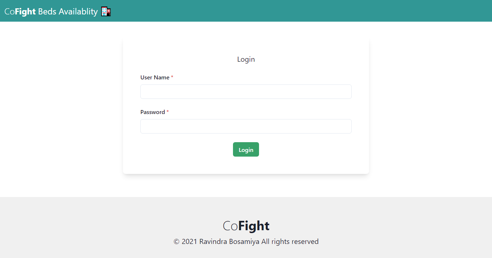

# Covid Bed availablity portal
Covid Bed availablity portal is a web app  made during covid 19 2nd wave to ease the process of finding bed in city.

## Feature
- Contact to hospital directly with whatsapp
- Get direction to hospital
- Tap to call
- Hospital can update data using whatsapp bot 
- Admin panel for editing / updating / deleting the bed details
- Easy hospital search

## Tech
React js , firebase

## Screenshots

HomePage

 

HospitalForm

 

Admin Login

 

Admin Dashboard

 

Edit Hospital Details

 

Hospital can update data using whatsapp bot

 

### Contact me

<a href="mailto:rbosamiya9@gmail.com">
<button>Email</button>
</a>

<a href="https://api.whatsapp.com/send?phone=918866669219&text=Hey!">
<button>Chat</button>
</a>